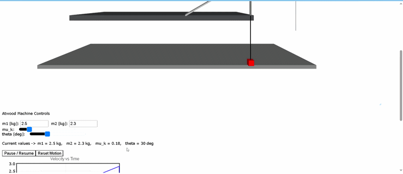

# Advanced Atwood Machine: 3D Physics Simulation
**St. John Baptist De La Salle Catholic School - Grade 11 Physics**

## Project Overview
This project is a 3D computational model of an Advanced Atwood Machine featuring a coupled system on a rough inclined plane. Instead of using standard algebraic kinematics, this simulation utilizes **Euler’s Numerical Integration** to calculate motion dynamically over infinitesimal time steps ($dt = 0.001s$).

 

## Key Features
* **Interactive Parameters:** Real-time adjustment of masses ($m1$, $m2$), coefficient of friction ($\mu$), and incline angle ($\theta$).
* **Numerical Calculus:** Uses a discrete integration loop to update acceleration, velocity, and position.
* **Friction Logic:** Accurately models the transition between Static and Kinetic friction, including a breakout threshold.
* **Live Graphing:** Real-time plots for Velocity vs. Time and Acceleration vs. Time.

## The Calculus Behind the Model
The simulation solves the following differential equation for acceleration ($a$) at every time step:

$$a = \frac{m_2g - m_1g\sin(\theta) - f_{fric}}{m_1 + m_2}$$

Where:
* **Velocity Update:** $v_{new} = v_{old} + a \cdot dt$
* **Position Update:** $x_{new} = x_{old} + v_{new} \cdot dt$

## How to Run
1. Copy the source code from `main.py`.
2. Navigate to [Web VPython](https://webvpython.org/).
3. Paste the code into a new script and click **Run**.

## Contributors
* **Section B: Group 2 & 8**
* Submitted: March 23, 2026
